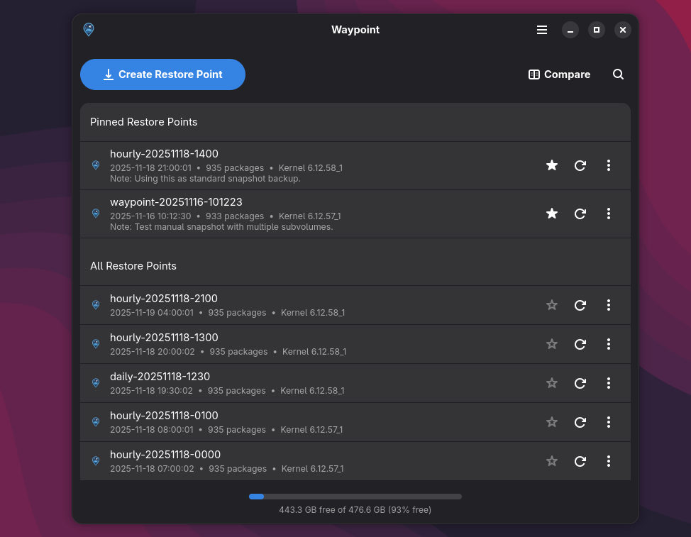
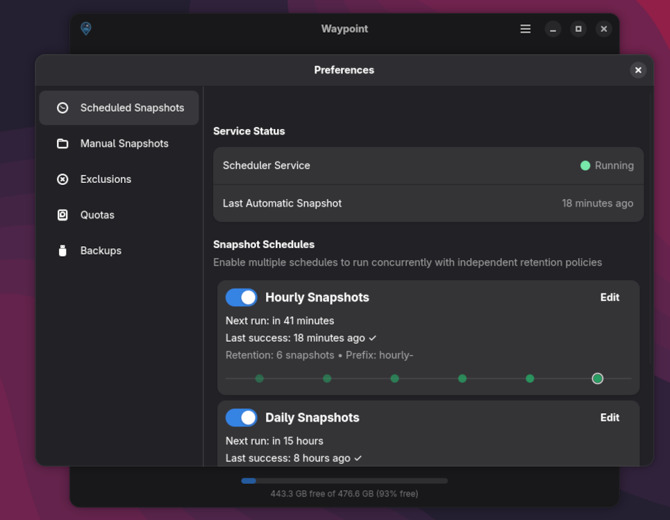

# Waypoint

NOTE: WAYPOINT IS CURRENTLY IN EARLY BETA. FEEL FREE TO USE IT, BUT KNOW THERE WILL STILL BE SOME BUGS.

Waypoint is a GTK/libadwaita snapshot and rollback tool with a built in scheduling service for Btrfs filesystems on Void Linux.

For Void Linux users, Waypoint integration is available on [Nebula](https://github.com/Letdown2491/nebula-gtk) >= 1.3.0 to automatically create system snapshots when performing system upgrades.

## Screenshots

<p align="center">
  
  
</p>

## Features

- One-click system rollback with automatic backup creation
- Rollback preview showing package changes before restoring
- Snapshot integrity verification via D-Bus
- Multi-subvolume support (/, /home, /var, etc.)
- Package state tracking with XBPS integration
- Package diff viewer with side-by-side comparison
- Per-user snapshot notes and favorites
- Search and filter with date ranges
- Browse snapshots in file manager
- Scheduled snapshots via runit service
- Retention policies for automatic cleanup
- Desktop notifications for snapshot events
- Command-line interface for scripting

## Integration

Other Void Linux tools can talk to the privileged helper over D-Bus to trigger snapshots, retention, scheduler changes, and more. See [API.md](API.md) for the complete interface used by Nebula.

## Requirements

- Void Linux with Btrfs filesystem
- GTK 4.10+ and libadwaita 1.4+ runtimes
- Rust 1.70 or newer
- DBus and Polkit
- @snapshots subvolume mounted at `/.snapshots`

## Quick Start

```sh
cargo run --bin waypoint
```

## Production Build

```sh
cargo build --release
```

The optimized binaries are written to `target/release/`. Use `cargo run --release` to execute the release build directly after compiling.

## System Install

```sh
./setup.sh install
```

The helper script builds the release binaries, installs them into `/usr/bin`, registers the desktop entry, D-Bus service, and Polkit policies. Use `sudo ./setup.sh uninstall` to remove those assets.

## Command Line

The CLI tool provides scriptable snapshot management:

```sh
# List all snapshots
waypoint-cli list

# Create a snapshot
waypoint-cli create "snapshot-name" "Optional description"

# Restore a snapshot
waypoint-cli restore "snapshot-name"

# Delete a snapshot
waypoint-cli delete "snapshot-name"

# Apply retention policy cleanup
waypoint-cli cleanup
```

## Scheduler Service

Enable automatic periodic snapshots:

```sh
# Enable the scheduler service
sudo ln -s /etc/sv/waypoint-scheduler /var/service/

# Configure via GUI or edit /etc/waypoint/scheduler.conf
```
