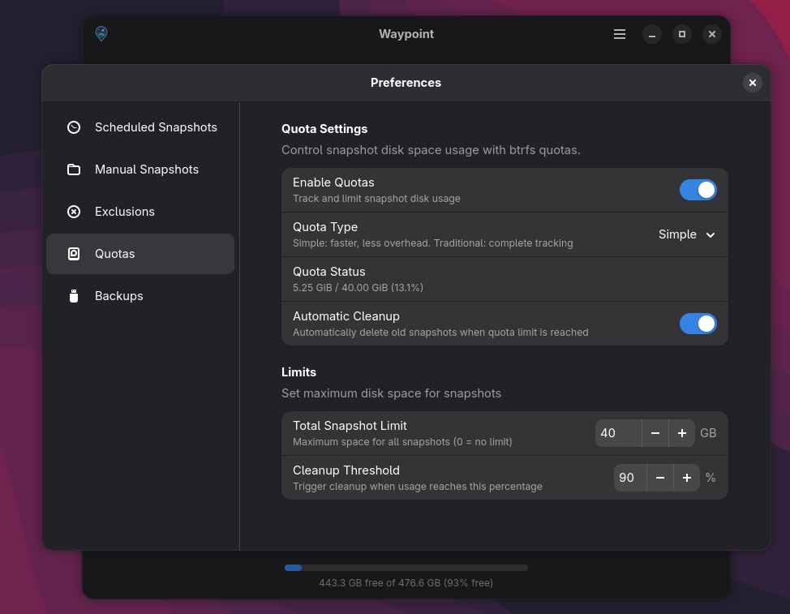
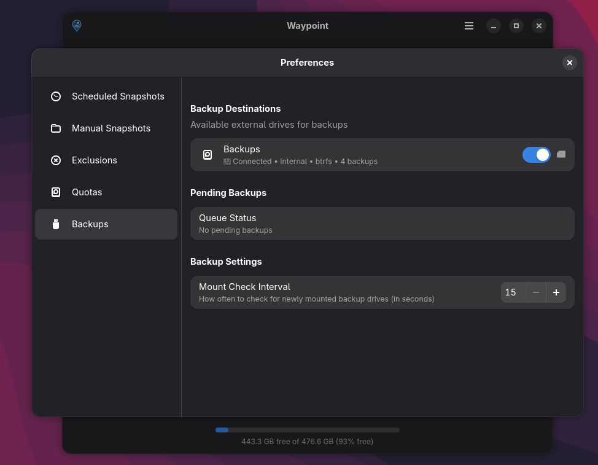

# Waypoint


Waypoint is a GTK/libadwaita snapshot and rollback tool with a built in scheduling service for Btrfs filesystems on Void Linux.

For Void Linux users, Waypoint integration is available on [Nebula](https://github.com/Letdown2491/nebula-gtk) >= 1.3.0 to automatically create system snapshots when performing system upgrades.

## Screenshots

<p align="center">
  
  
</p>
<p align="center">
  
  
</p>

## Features

- **System Snapshots & Rollback** - Create, restore, compare, and verify snapshots with rollback preview showing package changes and affected subvolumes
- **Backup to External Drives** - Automatic backups with incremental support for Btrfs drives and full backups for NTFS/exFAT/network shares
- **Flexible Scheduling** - Multiple concurrent schedules (hourly, daily, weekly, monthly) with timeline-based retention policies
- **Package Tracking** - Automatic XBPS package state tracking with version comparison and visual diff viewer
- **Analytics Dashboard** - Snapshot statistics, space usage trends, and actionable insights
- **Quota Management** - Configure Btrfs quotas with automatic cleanup triggers and disk space warnings
- **Modern Interface** - GTK4 + libadwaita UI with theme switching, real-time monitoring, and command-line tools
- **Security First** - Privilege-separated architecture with D-Bus, Polkit, audit logging, and input validation

[See full feature list →](docs/FEATURES.md)

## Integration

Other Void Linux tools can talk to the privileged helper over D-Bus to trigger snapshots, retention, scheduler changes, and more. See [API.md](docs/API.md) for the complete interface used by Nebula and [ARCHITECTURE.md](docs/ARCHITECTURE.md) for a high-level overview of the components and on-disk layout.

## Requirements

- Void Linux with Btrfs filesystem
- GTK 4.10+ and libadwaita 1.4+ runtimes
- Rust 1.70 or newer
- DBus and Polkit
- Rsync for snapshot backups to non-Btrfs drives
- @snapshots subvolume mounted at `/.snapshots`

## Installation

```sh
./setup.sh install
```

The helper script builds the release binaries, installs them into `/usr/bin`, registers the desktop entry, D-Bus service, and Polkit policies. Use `sudo ./setup.sh uninstall` to remove those assets.

## Quick Start

```sh
cargo run --bin waypoint
```

## Production Build

```sh
cargo build --release
```

The optimized binaries are written to `target/release/`. Use `cargo run --release` to execute the release build directly after compiling.

## Command Line

Waypoint includes a CLI tool for scripting and automation:

```sh
# List snapshots
waypoint-cli list
waypoint-cli list --verbose

# Create snapshot
waypoint-cli create "snapshot-name" "Description" "/,/home"

# Restore snapshot
waypoint-cli restore "snapshot-name"

# Backup to external drive
waypoint-cli backup "snapshot-name" "/mnt/backup-drive"

# Restore individual files
waypoint-cli restore-files "snapshot-name" "/etc/fstab"

# Manage quotas
waypoint-cli quota enable --simple
waypoint-cli quota set-limit 100G
```

[See complete CLI reference →](docs/CLI.md)

## Scheduler Service

Enable automatic periodic snapshots:

```sh
# Enable the scheduler service
sudo ln -s /etc/sv/waypoint-scheduler /var/service/

# Configure via GUI or edit /etc/waypoint/scheduler.conf
```
